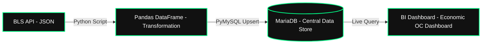

# Southern California Economic Indicators Data Pipeline


## 📖 Project Overview

This project is an automated end-to-end data pipeline that extracts regional macroeconomic data (focusing on Orange County and parts of the Los Angeles area) directly from the Bureau of Labor Statistics (BLS) API. The data is processed, cleaned, and loaded into a centralized relational database (MariaDB/MySQL) to feed into a dashboard.

**The Business Goal:** Break the "manual data gathering bottleneck" using the **Theory of Constraints (TOC)** framework. By automating the Extract, Transform, and Load (ETL) phases, we maximize system throughput, allowing analysts to focus on math/economic forecasting, scenario planning, and business strategy instead of repetitive spreadsheet management.

---

## 🏗️ Data Architecture & Flow

The pipeline follows a standard ETL architecture:

1. **Extract (API):** Python script calls the BLS v2 API for local metrics (e.g., OC Unemployment, LA Metro CPI, Nonfarm Employment).
2. **Transform (Pandas):** Raw JSON payloads are flattened, normalized, and timestamped.
3. **Load (SQL/MariaDB):** Data is inserted into a SQL database using `ON DUPLICATE KEY UPDATE` (upsert) logic to prevent duplication.
4. **Output (BI/YAML):** A materialized view feeds directly into a visualization dashboard.



---

## ⚙️ Theory of Constraints (TOC) Workflow & Application

To understand why this architecture was built, we apply the **5 Focusing Steps of the Theory of Constraints** to our data operations:

1. **Identify the Constraint:** Manual data extraction and spreadsheet management are our system bottlenecks. Analysts waste valuable hours and dollars(\$$$) gathering data instead of performing analysis.
2. **Exploit the Constraint:** Automate the entire `Extract` phase using the BLS API so external data is pulled instantly with zero manual effort.
3. **Subordinate Everything Else:** Align downstream scripting and storage so they run automatically on a fixed schedule, ensuring non-bottleneck processes don't create excess work or data duplication.
4. **Elevate the Constraint:** Implement bulk `UPSERT` operations and robust Python pipelines to handle high-frequency data ingestion securely without hitting rate limits or crashing.
5. **Prevent Inertia:** Continuously monitor the pipeline. Once data gathering is fully automated, the bottleneck shifts from *data collection* to *predictive modeling and executive decision-making*.

---

## 🛠️ Technologies Used

| Category | Tools |
|---|---|
| **Language** | Python 3.x |
| **Libraries** | `requests`, `pandas`, `pymysql`, `python-dotenv` |
| **Database** | MariaDB / MySQL |
| **APIs** | U.S. Bureau of Labor Statistics (BLS) API v2 |
| **Visualization/Output** | BI Dashboards / YAML configuration generation |

---

## 📂 Project Structure

```text
socal-economic-etl-pipeline/
│
├── data/
│   └── sample_output.csv         # Sample of the transformed data
│
├── sql/
│   ├── schema.sql                # SQL commands to create database tables
│   └── analytics_views.sql       # SQL views for calculating inflation/wage metrics
│
├── src/
│   ├── bls_api_extractor.py      # Core Python script for API extraction
│   ├── db_loader.py              # Script handling the MariaDB connection and upserts
│   └── dashboard_exporter.py     # Script to export YAML config for the dashboard
│
├── .env.example                  # Template for local environment variables
├── requirements.txt              # Python library dependencies
└── README.md                     # Project documentation
```

---

## 🚀 Setup & Reproduction Instructions

### 1. Prerequisites

* Python 3.8+ installed
* Access to a MariaDB/MySQL instance
* An optional (but recommended) BLS API Key from [data.bls.gov](https://data.bls.gov/registrationEngine/)

### 2. Clone the Repository

```bash
git clone https://github.com/your-username/socal-economic-etl-pipeline.git
cd socal-economic-etl-pipeline
```

### 3. Install Dependencies

```bash
pip install -r requirements.txt
```

### 4. Configure Environment Variables

Create a file named `.env` in the root directory and add your credentials:

```env
BLS_API_KEY=your_api_key_here
DB_HOST=your_mariadb_host_ip
DB_PORT=43306
DB_USER=your_username
DB_PASSWORD=your_password
DB_NAME=economic_data
```

> ⚠️ **Note:** Never commit your `.env` file. Make sure it's listed in `.gitignore`.

### 5. Initialize the Database

Run the schema file in your SQL client to build the staging tables:

```bash
mysql -h your_mariadb_host_ip -P 43306 -u your_username -p < sql/schema.sql
```

### 6. Run the Pipeline

Execute the main script to fetch the data and load it into your database:

```bash
python src/bls_api_extractor.py
```

---

## 📈 Dashboard & Analytical Value (Theory of Constraints)

This pipeline enables direct calculation of key forecasting models for executive leadership:

* **Real Wage Growth:** Tracking local average hourly earnings against the OC CPI to adjust regional payroll budgets.
* **Cost of Living Impacts:** Using the Shelter Index to estimate localized operational expense increases.
* **Labor Market Tightness:** Tracking Orange County unemployment figures to forecast talent acquisition difficulty.

By breaking the data aggregation constraint, we shift operational expense ($OE$) away from manual labor, elevating total system throughput ($T$) in our forecasting and decision-making capabilities.

---


## 📄 License

This project is licensed under the MIT License — see the `LICENSE` file for details.


